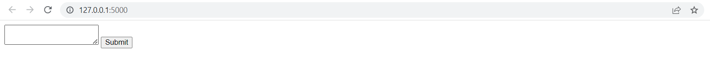
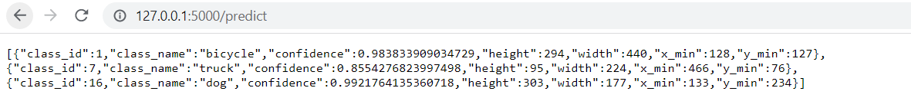
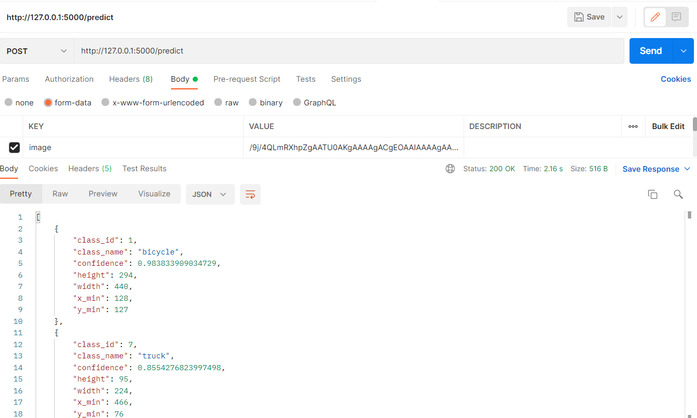
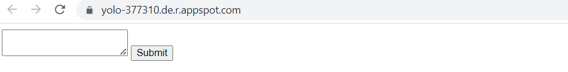
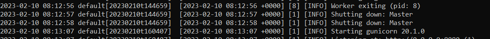

# YOLOv4
YOLO" is an acronym that stands for "You Only Look Once". It is a popular real-time object detection system, widely used for various computer vision. YOLOv4 is an improvement over its predecessors, YOLOv3 and YOLOv2, in terms of both accuracy and speed.

This project aims to deploy the open-source YOLOv4 model on AWS.
## Setup
```bash
pip install -r requirements.txt
```
Download YOLOv4 network configuration
https://github.com/AlexeyAB/darknet/releases/download/darknet_yolo_v3_optimal/yolov4.weights
<br />
Download YOLOv4 weights 
https://github.com/AlexeyAB/darknet/releases/download/darknet_yolo_v3_optimal/yolov4.cfg
<br />
Put the cfg and weight file inside the data folder

## Convert Image to Base64 text
```bash
python img_b64_txt.py
```
The above python program will convert all the images inside data/* and create a text file of base64 str for each of the image at data/base64/*

## Running Flask App Locally
To run the app locally, run the following command in the cmd
```bash
python main.py
```
The server is set up at (http://127.0.0.1:5000/)


Upload image as base64 text and click submit to send the post request. Example of result returned is shown below.


Alternatively, you can post to (http://127.0.0.1:5000/predict) using http client like postman to yield the result.


## Running Flask on Webserver
The webserver is set up at (https://yolo-377310.de.r.appspot.com/)

Post request is still not working yet and the gcp logs do not provide any useful information to debug.
